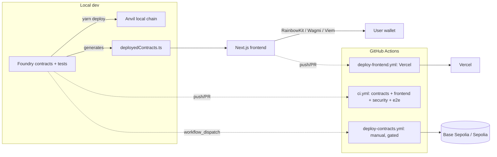

# EVM Hackathon Factory

An agent-native, production-capable environment for building an EVM/Web3
social-good dapp fast: **idea → prototype → testnet → demo → production**.
Built on [Scaffold-ETH 2](https://scaffoldeth.io) (Foundry flavor) + Next.js,
with the deploy pipeline, testing, CI/CD, and agent instructions already wired
together.

> [!NOTE]
> 🤖 This repo is AI-agent-ready. Start with [`AGENTS.md`](AGENTS.md) — it's
> the canonical guide for architecture, golden rules, commands, and the
> [`.claude/skills/`](.claude/skills/) index (contract dev, security review,
> frontend web3, testing, deployment, CI, hackathon execution).

## What is this?

A working full-stack dapp skeleton, not just dependencies:

- **`packages/foundry`** — Solidity contracts (Foundry), tests (unit + fuzz +
  invariant), deploy scripts, account/keystore management
- **`packages/nextjs`** — Next.js frontend (RainbowKit, Wagmi, Viem, Tailwind
  + DaisyUI), wired to read whatever's deployed via auto-generated ABIs
- **`scripts/`** — one-command dev (`dev:all`), deployment manifests, demo
  data seeding
- **`.github/workflows/`** — CI (contracts + frontend + security + e2e),
  manual-dispatch contract deploys (testnet/production, gated), frontend
  deploy (Vercel + optional GitHub Pages)
- **`.claude/skills/`**, **`AGENTS.md`** — so a coding agent (or a new
  teammate) can pick this up and start building the actual product
  immediately, without rediscovering the architecture

The shipped contract (`YourContract.sol`) is a stock example — the point is
proving deploy → ABI generation → frontend read → e2e test all work together
out of the box. Replace it with your real idea; see
[`.claude/skills/dapp-product-development/SKILL.md`](.claude/skills/dapp-product-development/SKILL.md).



## Install

Requirements: Node ≥ 20.18.3, [Foundry](https://getfoundry.sh) ≥ 1.4.0, Git.
See [`docs/development.md`](docs/development.md) for exact versions this repo
was built and tested against, and Windows-specific setup notes.

```bash
corepack enable   # activates the pinned yarn 4 from package.json
yarn install
yarn doctor       # verifies your toolchain before you go any further
```

## Run

```bash
yarn dev:all
```

One command: starts Anvil, deploys the contracts, starts the frontend at
`http://localhost:3000`. Ctrl-C stops everything. (Or run `yarn chain`,
`yarn deploy`, `yarn start` in three terminals if you want them separate.)

## Test

```bash
yarn check       # fast: format/lint check, typecheck, address drift
yarn test:all    # full: forge test (incl. fuzz + invariant), next build, e2e
```

See [`.claude/skills/testing/SKILL.md`](.claude/skills/testing/SKILL.md) for
the testing conventions this repo follows.

## Deploy contracts

```bash
yarn deploy --network baseSepolia
yarn workspace @se-2/foundry verify RPC_URL=baseSepolia
```

Or trigger `.github/workflows/deploy-contracts.yml` (manual dispatch) for a
consistent, logged deployment with an auto-generated manifest. Full walkthrough,
required secrets, and the production-deploy approval gate:
[`docs/deployment.md`](docs/deployment.md).

## Deploy frontend

Connect the repo at [vercel.com/new](https://vercel.com/new) (simplest), or
use `.github/workflows/deploy-frontend.yml` if you want deploys gated behind
CI. A GitHub Pages fallback (`.github/workflows/pages.yml`, manual dispatch)
is also available — this app is a pure client-side dapp, confirmed
static-export-compatible. Details: [`docs/deployment.md`](docs/deployment.md).

## Where things are

| | |
|---|---|
| Contracts | `packages/foundry/contracts/` |
| Contract tests | `packages/foundry/test/` |
| Deploy scripts | `packages/foundry/script/` |
| Frontend | `packages/nextjs/app/` |
| Frontend e2e tests | `packages/nextjs/e2e/` |
| Supported networks | `packages/foundry/foundry.toml` (`[rpc_endpoints]`), `packages/nextjs/scaffold.config.ts` (`targetNetworks`) — localhost, Ethereum Sepolia, Base Sepolia by default; Optimism/Arbitrum Sepolia, Celo Sepolia, Polygon Amoy also configured |
| Deployed addresses | `packages/foundry/deployments/<chainId>.json` (auto-generated, never hand-edited — see `scripts/record-deployment.mjs`) |

## Contributing

See [`CONTRIBUTING.md`](CONTRIBUTING.md) for the git workflow, commit
convention, and pre-PR checklist for *this* repo.

## More docs

- [`docs/architecture.md`](docs/architecture.md) — how the pieces fit together
- [`docs/development.md`](docs/development.md) — exact tool versions, Windows notes, local dev details
- [`docs/deployment.md`](docs/deployment.md) — full deploy walkthrough (local → testnet → production)
- [`docs/security.md`](docs/security.md) — this repo's security posture and CI security checks
- [`docs/hackathon.md`](docs/hackathon.md) — 5-minute setup, demo workflow, submission checklist
- [`docs/on-chain-vs-off-chain.md`](docs/on-chain-vs-off-chain.md) — how to classify feature data
